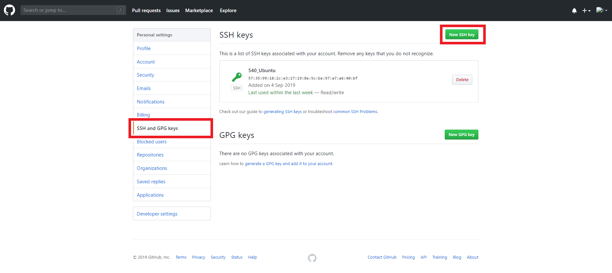
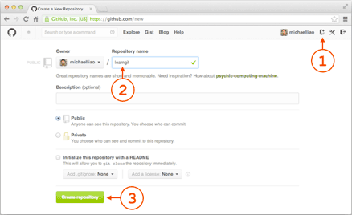

# Git 使用指南

## 0. Ref

https://www.liaoxuefeng.com/wiki/896043488029600

## 1. Git 安装

### Linux

#### 包管理

```bash
$ git
# 如果提示没有安装, 则 sudo apt-get install git 安装
```

#### 源码安装

从 Git 官网下载源码

```bash
$ ./config
$ make
$ sudo make install
```

### Windows

1. 下载安装包：https://git-scm.com/downloads

2. 打开 `Git bash`

   ```powershell
   $ git config --global user.name "suhao314"
   $ git config --global user.email "suhao314@mail.ustc.edu.cn"
   # global 参数指示该机器上的所有 Git 仓库都使用该配置
   ```

## 2. 创建 Repository

   相当于是一个目录。

   ```bash
   # 切换至合适的工作目录
   $ mkdir learngit
   $ cd learngit
   $ pwd
   /Users/michael/learngit
   # 目录名不要包含中文
   
   # 指示 git 可以管理该Repository
   $ git init
   # 至此已建立一个空的 Repository
   ```

   **版本控制只能跟踪文本文件，例如 `.doc .jpeg .flv` 等非文本文件是无法跟踪改动的**

   在本地电脑 `learngit` 目录下放入文件 `readme.md`

   ```bash
   # 将文件添加到 Repository
   $ git add readme.md
   
   # 将文件提交到 Repository
   $ git commit -m "wrote a readme file"
   
   # 可以先 add 所有要提交的文件, 再一并 commit
   $ git add file1.txt
   $ git add file2.txt file3.txt
   $ git commit -m "add 3 files."
   
   # 添加整个文件夹
   $ git add dirName/
   ```

   ## 3. 版本控制

### 版本回退

检查 Repository 状态

```bash
$ git status
```

检查修改

```bash
$ git diff
```

查看修改记录

```bash
$ git log
# 显示历次修改的作者,时间和提交时 -m 参数所附加的信息

# commit 1094adb7b9b3807259d8cb349e7df1d4d6477073 (HEAD -> master)
# Author: Michael Liao <askxuefeng@gmail.com>
# Date:   Fri May 18 21:06:15 2018 +0800
# 
#     append GPL
# 
# commit e475afc93c209a690c39c13a46716e8fa000c366
# Author: Michael Liao <askxuefeng@gmail.com>
# Date:   Fri May 18 21:03:36 2018 +0800
# 
#     add distributed
# 
# commit eaadf4e385e865d25c48e7ca9c8395c3f7dfaef0
# Author: Michael Liao <askxuefeng@gmail.com>
# Date:   Fri May 18 20:59:18 2018 +0800
# 
#     wrote a readme file

# 简化输出
$ git log --pretty=oneline
```

版本回退

```bash
# 回退至上一个版本
$ git reset --hard HEAD^
 
# 回退至某指定 commit id 的版本
$ git reset --hard 1094a

```

查看历次 Git 命令

```bash
git reflog
```

### 工作区和暂存区

#### 工作区 Working Directory

就是你在电脑里能看到的目录，比如 `learngit` 文件夹就是一个工作区

#### (本地)版本库 Repository

工作区有一个隐藏目录`.git`，这个不算工作区，而是 Git 的版本库。

Git的版本库里存了很多东西，其中最重要的就是称为 `stage`(或者叫 `index`) 的暂存区，还有 Git 为我们自动创建的第一个分支 `master` ，以及指向 `master` 的一个指针叫 `HEAD` 。


把文件往Git版本库里添加的时候，是分两步执行的：

第一步是用 `git add` 把文件添加进去，*实际上就是把文件修改添加到暂存区*

第二步是用 `git commit` 提交更改，*实际上就是把暂存区的所有内容提交到当前分支*

*需要提交的文件修改都放到暂存区，然后，一次性提交暂存区的所有修改*

```bash
git add readme.txt
git add LICENSE
```


```bash
$ git commit -m "understand how stage works"
```


### 管理和撤销修改

由于 Git 管理的是修改，显然，某文件 `file` 经修改，变为 `file1` ，然后 `git add`，再修改 `file1`，变为 `file2`，之后 `git commit` ，那么只提交了第一次修改即 `file1` 即第二次修改不会被提交

#### 丢弃工作区的修改

让这个文件回到最近一次 `git commit` 或 `git add` 时的状态

* `readme.txt` 自修改后还没有被放到暂存区 `stage` (还没有 `git add`)，现在，撤销修改就回到和版本库一模一样的状态
* `readme.txt` 已经添加到暂存区 `stage` (已经 `git add`) 后，又作了修改，现在，撤销修改就回到添加到暂存区后的状态 

```bash
$ git checkout -- readme.txt
```

#### 丢弃版本库暂存区 `stage` 的修改

```bash
$ git reset HEAD readme.txt
```

`git reset` 命令既可以回退版本，也可以把暂存区的修改回退到工作区。当我们用`HEAD`时，表示最新的版本。

### 删除文件

```bash
# 先添加一个 test.txt 文件
$ git add test.txt
$ git commit -m "add test.txt"
```

在文件管理器中删除该文件：导致工作区和版本库的不一致；查看那些文件被(不正确地删除)

```bash
$ git status
```

```bash
# 从版本库中真正地删除文件 test.txt
$ git rm test.txt
$ git commit -m "remove test.txt"

# 删除文件夹
git rm -r dirName/
$ git commit -m "remove dirName"
```

将(使用文件管理器)删除的文件恢复

```bash
$ git checkout -- test.txt
```

`git checkout` 其实是用版本库里的版本替换工作区的版本，无论工作区是修改还是删除，都可以一键还原

**从来没有被添加到版本库就被删除的文件，是无法恢复的**

命令 `git rm` 用于删除一个文件。如果一个文件已经被提交到版本库，那么永远不用担心误删，但是要小心，只能恢复文件到最新版本，因此会丢失**最近一次提交后你修改的内容**。

## 4. 远程仓库(Github或自建仓库)

Git是分布式版本控制系统，同一个Git仓库，可以分布到不同的机器上。

### SSH Key

本地Git仓库和GitHub仓库之间的传输是通过SSH加密的，所以，需要一点设置：

1. 创建 SSH Key

```bash
$ ssh-keygen -t rsa -C "suhao314@mail.ustc.edu.cn"
# Windows 下载 Git Bash 中操作
# 创建过程使用默认值即可
```

如果一切顺利的话，可以在用户主目录里找到 `.ssh` 目录，里面有 `id_rsa` 和 `id_rsa.pub` 两个文件，这两个就是SSH Key的秘钥对， `id_rsa` 是私钥，不能泄露出去，`id_rsa.pub` 是公钥，可以放心地告诉任何人。

2. 登陆GitHub，打开Account settings，SSH Keys页面；点击Add SSH Key，填上任意Title，在Key文本框里粘贴 `id_rsa.pub` 文件的内容；最后点击Add key




#### 该步骤的必要性

GitHub需要识别出你推送的提交确实是你推送的，而不是别人冒充的，而Git支持SSH协议，所以，GitHub只要知道了你的公钥，就可以确认只有你自己才能推送。

当然，GitHub允许你添加多个Key。假定你有若干电脑，你一会儿在公司提交，一会儿在家里提交，只要把每台电脑的Key都添加到GitHub，就可以在每台电脑上往GitHub推送了。

*在GitHub上免费托管的Git仓库，任何人都可以看到，但只有你自己才能改*

### 添加远程库

已经在本地创建了一个Git仓库后，又想在GitHub创建一个Git仓库，并且让这两个仓库进行远程同步，这样，GitHub上的仓库既可以作为备份，又可以让其他人通过该仓库来协作

1. 登陆GitHub，然后，在右上角找到“Create a new repo”按钮，创建一个新的仓库

   

   在Repository name填入`learngit`，其他保持默认设置，点击Create repository按钮，就成功地创建了一个新的Git仓库

   

2. 把本地仓库的内容推送到GitHub仓库

   ```bash
   $ git remote add origin git@github.com:suhao314/learngit.git
   ```

   添加后，远程库的名字就是`origin`，这是Git默认的叫法，也可以改成别的，但是`origin`这个名字一看就知道是远程库
   
   **本地仓库中（即相应目录下）要有文件，才能成功推送**
   
   把本地库的所有内容推送到远程库上：
   
   ```bash
   $ git push -u origin master
   ```
   
   把本地库的内容推送到远程，用 `git push` 命令，实际上是把当前分支 `master` 推送到远程。
   
   由于远程库是空的，我们**第一次推送 `master` 分支时，加上了 `-u` 参数**，Git不但会把本地的 `master` 分支内容推送的远程新的 `master` 分支，还会把本地的 `master` 分支和远程的 `master` 分支关联起来，在以后的推送或者拉取时就可以简化命令。
   
3. 提交新的修改

   ```bash
   $ git push origin master
   ```

   #### 小结

   要关联一个远程库，使用命令 `git remote add origin git@server-name:path/repo-name.git`

   关联后，使用命令 `git push -u origin master` 第一次推送master分支的所有内容

   此后，每次本地提交后，只要有必要，就可以使用命令 `git push origin master` 推送最新修改；

   分布式版本系统的最大好处之一是在本地工作完全不需要考虑远程库的存在，也就是有没有联网都可以正常工作，而SVN在没有联网的时候是拒绝干活的！当有网络的时候，再把本地提交推送一下就完成了同步


### 从远程库克隆

```bash
# 克隆至本地工作目录
$ git clone https://github.com/QSCTech/zju-icicles.git
```

## 5. 分支管理

分支在实际中有什么用呢？假设你准备开发一个新功能，但是需要两周才能完成，第一周你写了50%的代码，如果立刻提交，由于代码还没写完，不完整的代码库会导致别人不能干活了。如果等代码全部写完再一次提交，又存在丢失每天进度的巨大风险。

现在有了分支，就不用怕了。你创建了一个属于你自己的分支，别人看不到，还继续在原来的分支上正常工作，而你在自己的分支上干活，想提交就提交，直到开发完毕后，再一次性合并到原来的分支上，这样，既安全，又不影响别人工作。

### 创建与合并分支

每次提交，Git都把它们串成一条时间线，这条时间线就是一个分支。截止到目前，只有一条时间线，在Git里，这个分支叫主分支，即 `master` 分支。 `HEAD` 严格来说不是指向提交，而是指向 `master`，`master` 才是指向提交的，所以，**`HEAD` 指向的就是当前分支**。

一开始的时候，`master` 分支是一条线，Git用 `master` 指向最新的提交，再用 `HEAD` 指向 `master`，就能确定当前分支，以及当前分支的提交点：


每次提交，`master` 分支都会向前移动一步，这样，随着你不断提交，`master` 分支的线也越来越长。

当我们创建新的分支，例如 `dev` 时，Git新建了一个指针叫 `dev` ，指向 `master` 相同的提交，再把 `HEAD` 指向 `dev`，就表示当前分支在 `dev` 上：


Git创建一个分支很快，因为除了增加一个`dev`指针，改改`HEAD`的指向，工作区的文件都没有任何变化

不过，从现在开始，对工作区的修改和提交就是针对 `dev` 分支了，比如新提交一次后，`dev` 指针往前移动一步，而 `master` 指针不变：


假如我们在 `dev` 上的工作完成了，就可以把 `dev` 合并到 `master` 上。最简单的方法，就是直接把 `master` 指向 `dev` 的当前提交，就完成了合并：


所以Git合并分支也很快：仅修改指针，工作区内容不变

合并完分支后，甚至可以删除 `dev` 分支。删除 `dev` 分支就是把 `dev` 指针给删掉，删掉后，就只剩下了一条 `master` 分支：


#### 创建并切换到 `dev` 分支

```bash
$ git checkout -b dev
# 相当于如下两条指令
$ git branch dev										# 创建 dev 分支
$ git checkout dev									 # 切换到 dev 分支

# 切换或创建分支时推荐使用 switch
$ git switch branchName						 # 切换分支
$ git switch -c dev										# 创建并切换到 dev 分支
```

#### 查看当前分支

```bash
$ git branch
# 当前所在分支前以 * 标记
```

#### 删除分支

```bash
$ git branch -d dev									# 删除 dev 分支
```

#### 合并 `branchName` 分支到当前分支

```bash
# 假定当前在 master 分支
$ git merge branchName
# 将 branchName 分支合并到当前所在的 master 分支
```

### 解决冲突


在 `master` 分支下无法讲 `feature1` 分支快速合并进来，因为可能存在冲突

#### 检查冲突

```bash
$ git status
# 该命令会提示有哪些文件存在冲突
$ cat fileName
#		查看存在冲突的文件，如下：
#
#		Git is a distributed version control system.
#		Git is free software distributed under the GPL.
#		Git has a mutable index called stage.
#		Git tracks changes of files.
#		<<<<<<< HEAD
#		Creating a new branch is quick & simple.
#		=======
#		Creating a new branch is quick AND simple.
#		>>>>>>> feature1
#
```

#### 解决冲突

由自己决定保留谁，并手动修改，完成修改后：

```bash
$ git add fileName
$ git commit -m "conflist fixed"
```


解决完冲突后，可删除 `feature1` 分支

```bash
$ git branch -d feature1
```

#### 查看分支合并情况

```bash
$ git log --graph --pretty=oneline --abbrev-commit
```

### 分支管理策略

`master` 分支仅用于发布新版本，不应该在其上干活

开发应该在 `dev` 分支上，开发完成后合并分支到 `master` 分支

### `stash` 功能

#### 应用场景

当前正在 `dev` 分支上开发，但 `commit` 尚需一段时间（此时尚不能 `commit`）

紧急修bug时，使用该功能把当前工作现场暂存起来，待修完bug后恢复并继续工作

```bash
$ git stash
$ git checkout master										 # 切换至 master 分支修bug
$ git checkout -b issue-bug101						# 创建用于修 bug 的分支
# fixxing bug101
$ git add .
$ git commit -m "bug101 fixed"
$ git checkout master										# 切换回 master 分支，以合并新的修改
$ git merge --no-ff -m "merged bug fix 101" issue-bug101

$ git checkout dev

$ git stash list														# 检查是否有 stash 内容						

# 恢复
$ git stash apply													# 恢复（此时不会删除stash）
$ git stash drop													 # 删除 stash
# 或者
$ git stash pop														  # 恢复并删除stash，相当于以上两条指令


# 在 dev 分支上也修复同样的 bug ，假定 bug101 fixed 分支的 commit ID 为 4c805e2
$ git cherry-pick 4c805e2
```

