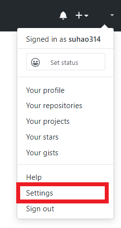

# Git 使用指南

## 0. Ref

https://www.liaoxuefeng.com/wiki/896043488029600

## 1. Git 安装

### Linux

#### 包管理

```bash
$ git
# 如果提示没有安装, 则 sudo apt-get install git 安装
```

#### 源码安装

从 Git 官网下载源码

```bash
$ ./config
$ make
$ sudo make install
```

### Windows

1. 下载安装包：https://git-scm.com/downloads

2. 打开 `Git bash`

   ```shell
   $ git config --global user.name "suhao314"
   $ git config --global user.email "suhao314@mail.ustc.edu.cn"
   # global 参数指示该机器上的所有 Git 仓库都使用该配置
   ```

## 2. 创建 Repository

   相当于是一个目录。

   ```bash
# 切换至合适的工作目录
$ mkdir learngit
$ cd learngit
$ pwd
/Users/michael/learngit
# 目录名不要包含中文
   
# 指示 git 可以管理该Repository
$ git init
# 至此已建立一个空的 Repository
   ```

   **版本控制只能跟踪文本文件，例如 `.doc .jpeg .flv` 等非文本文件是无法跟踪改动的**

   在本地电脑 `learngit` 目录下放入文件 `readme.md`

   ```bash
# 将文件添加到 Repository
$ git add readme.md
   
# 将文件提交到 Repository
$ git commit -m "wrote a readme file"
   
# 可以先 add 所有要提交的文件, 再一并 commit
$ git add file1.txt
$ git add file2.txt file3.txt
$ git commit -m "add 3 files."
   
# 添加整个文件夹
$ git add dirName/
   ```

   ## 3. 版本控制

### 版本回退

检查 Repository 状态

```bash
$ git status
```

检查修改

```bash
$ git diff fileName
```

查看修改记录

```bash
$ git log
# 显示历次修改的作者,时间和提交时 -m 参数所附加的信息

# commit 1094adb7b9b3807259d8cb349e7df1d4d6477073 (HEAD -> master)
# Author: Michael Liao <askxuefeng@gmail.com>
# Date:   Fri May 18 21:06:15 2018 +0800
# 
#     append GPL
# 
# commit e475afc93c209a690c39c13a46716e8fa000c366
# Author: Michael Liao <askxuefeng@gmail.com>
# Date:   Fri May 18 21:03:36 2018 +0800
# 
#     add distributed
# 
# commit eaadf4e385e865d25c48e7ca9c8395c3f7dfaef0
# Author: Michael Liao <askxuefeng@gmail.com>
# Date:   Fri May 18 20:59:18 2018 +0800
# 
#     wrote a readme file

# 简化输出
$ git log --pretty=oneline
$ git log --graph --pretty=oneline --abbrev-commit
```

版本回退

```bash
# 从当前版本 A 回退至上一个版本 B
$ git reset --hard HEAD^
# 回退之后，git log 中 A 的记录将消失，撤销回退需要：
# 1. 窗口未关闭
# 2. 知道 A 的 commit id
 
# 回退至某指定 commit id 的版本
# 回退之后的后悔药：
$ git reset --hard 1094a
```

查看历次 Git 命令

```bash
git reflog
```

### 工作区和暂存区


#### 工作区 Working Directory

即在电脑里能看到的目录，比如 `learngit` 文件夹就是一个工作区

#### (本地)版本库 Repository

工作区有一个隐藏目录`.git`，该文件夹不算工作区，而是 Git 的版本库。

Git的版本库里存了很多东西，其中最重要的就是称为 `stage`(或者叫 `index`) 的暂存区，还有 Git 为我们自动创建的第一个分支 `master` ，以及指向 `master` 的一个指针叫 `HEAD` 。

##### 暂存区 Stage/Index

把文件往 Git 版本库里添加的时候，实际上被分两步执行：

1.  *`git add` 把文件修改添加到暂存区*

2.  `git commit` 提交更改，*把暂存区的所有内容提交到当前分支*

*需要提交的文件修改都放到暂存区，然后，一次性提交暂存区的所有修改*

```bash
git add readme.txt
git add LICENSE
```


```bash
$ git commit -m "understand how stage works"
```


### 管理和撤销修改

由于 Git 管理的是修改，显然，某文件 `file` 经修改，变为 `file1` ，然后 `git add`，再修改 `file1`，变为 `file2`，之后 `git commit` ，那么只提交了第一次修改即 `file1` 即第二次修改不会被提交

#### 撤销修改

* 文件被修改，但还没有 `git add`

  * 手动改回去

  * ```shell
    # 撤销至和 版本库 一致的状态
    $ git checkout -- fileName
    ```

* 已经被 `git add` 至暂存区 Stage，放弃工作区的改动，回到和 `git add` 时一致的状态

  * ```shell
    $ git checkout-- fileName
    ```

* **`git checkout -- fileName` 会使文件回到最近一次 `git commit` 或 `git add` 时的状态**

#### 丢弃版本库暂存区 `stage` 中的修改

```bash
$ git reset HEAD fileName
```

`git reset` 命令既可以回退版本，也可以把暂存区的修改回退到工作区。当我们用`HEAD`时，表示最新的版本。

### 删除文件与误删恢复

* 删除文件

  ```shell
  # 在文件资源管理器中删除不要的文件
  $ rm -rf fileName
  
  # 在 git 版本库中删除
  $ git rm fileName					# 或者 git add .
  $ git commit -m "delete fileName"
  ```

* 误删恢复

  ```shell
  git checkout -- misDeletedFileName
  ```

## 4. 远程仓库(Github或自建仓库)

Git是分布式版本控制系统，同一个Git仓库，可以分布到不同的机器上。

### SSH Key

本地Git仓库和GitHub仓库之间的传输通过SSH加密，需要进行如下设置：

1. 创建 SSH Key

   ```bash
   $ ssh-keygen -t rsa -C "suhao314@mail.ustc.edu.cn"
   # Windows 下载 Git Bash 中操作
   # 创建过程使用默认值即可
   ```
   
   在用户主目录里找到 `.ssh` 目录，里面有 `id_rsa` 和 `id_rsa.pub` 两个文件，是SSH Key的秘钥对， `id_rsa` 是私钥，不能泄露，`id_rsa.pub` 是公钥，可以告诉任何人

2. 登陆GitHub，打开Account settings，SSH Keys页面；点击Add SSH Key，填上Title，在Key文本框里粘贴 `id_rsa.pub` 文件的内容；最后点击Add key




#### 该步骤的必要性

GitHub需要识别出你推送的提交确实是你推送的，而不是别人冒充的。而Git支持SSH协议，GitHub只要知道了公钥，就可以确认只有对应私钥持有者才能推送。

当然，GitHub允许添加多个Key，适用于多台电脑的场景

*在GitHub上免费托管的Git仓库，任何人都可以看到，但只有你自己才能改*

### 添加远程库

本地和Github上的仓库保持同步：备份和协作

1. 登陆GitHub，然后，在右上角找到“Create a new repo”按钮，创建一个新的仓库

   

   在Repository name填入`learngit`，其他保持默认设置，点击Create repository按钮，成功创建了一个新的Git仓库

   

2. 将本地仓库推送到GitHub仓库

   ```bash
   $ git remote add origin git@github.com:suhao314/learngit.git
   ```

   添加后，远程库的名字就是`origin`，是Git默认的叫法，可被修改
   
   **本地仓库中（即相应目录下）要有文件，才能成功推送**
   
   把本地库的所有内容（第一次）推送到远程库上：
   
   ```bash
   $ git push -u origin master
   ```
   
   把本地库推送到远程，使用 `git push` 命令，实际上是把当前分支 `master` 推送到远程。
   
   由于远程库是空的，**第一次推送 `master` 分支时，加上 `-u` 参数**：Git不但会把本地的 `master` 分支推送的远程新的 `master` 分支，还会把本地的 `master` 分支和远程的 `master` 分支关联起来；后续 `push` 和 `pull` 时可以简化命令
   
3. 提交新的修改（后续推送）

   ```bash
   $ git push origin master
   ```

#### 小结

   * 关联一个远程库： `git remote add origin git@server-name:path/repo-name.git`

* 关联后的第一次推送`git push -u origin master` 

* 后续推送`git push origin master` 

### 从远程库克隆

```bash
# 克隆至本地工作目录
$ git clone https://github.com/QSCTech/zju-icicles.git
# 将会在当前目录下创建 zju-includes-master 文件夹
```

## 5. 分支管理

分支在实际中有什么用呢？假设你准备开发一个新功能，但是需要两周才能完成，第一周你写了50%的代码，如果立刻提交，由于代码还没写完，不完整的代码库会导致别人不能干活了。如果等代码全部写完再一次提交，又存在丢失每天进度的巨大风险。

现在有了分支，就不用怕了。你创建了一个属于你自己的分支，别人看不到，还继续在原来的分支上正常工作，而你在自己的分支上干活，想提交就提交，直到开发完毕后，再一次性合并到原来的分支上，这样，既安全，又不影响别人工作。

### 创建与合并分支

Git将每次提交串成一条时间线，这条时间线就是一个分支。截止到目前，只有一条时间线，在Git里，这个分支叫主分支，即 `master` 分支。 `HEAD` 严格来说不是指向提交，而是指向 `master`，`master` 才是指向提交的，所以，**`HEAD` 指向的就是当前分支**。

一开始，`master` 分支是一条线，Git用 `master` 指向最新的提交，再用 `HEAD` 指向 `master`，就能确定当前分支，以及当前分支的提交点：


每次提交，`master` 分支都会向前移动一步，这样，随着不断提交，`master` 分支的线也越来越长。

当创建新的分支，例如 `dev` 时，Git新建了一个指针叫 `dev` ，指向 `master` 相同的提交，再把 `HEAD` 指向 `dev`，就表示当前分支在 `dev` 上：


Git创建一个分支很快，因为除了增加一个`dev`指针，改改`HEAD`的指向，工作区的文件都没有任何变化

不过，从现在开始，对工作区的修改和提交就是针对 `dev` 分支了，比如新提交一次后，`dev` 指针往前移动一步，而 `master` 指针不变：


假如我们在 `dev` 上的工作完成了，就可以把 `dev` 合并到 `master` 上。最简单的方法，就是直接把 `master` 指向 `dev` 的当前提交，就完成了合并：


所以Git合并分支也很快：仅修改指针，工作区内容不变

合并完分支后，甚至可以删除 `dev` 分支。删除 `dev` 分支就是把 `dev` 指针给删掉，删掉后，就只剩下了一条 `master` 分支：


#### 创建并切换到 `dev` 分支

```bash
$ git switch branchName						 			# 切换分支
$ git switch -c dev										# 创建并切换到 dev 分支
```

#### 查看(当前)分支

```bash
$ git branch
# 当前所在分支前以 * 标记
```

#### 删除分支

```bash
$ git branch -d dev										# 删除 dev 分支
```

#### 合并 `branchName` 分支到当前分支

```bash
# 假定当前在 master 分支
$ git merge branchName
# 将 branchName 分支合并到当前所在的 master 分支
```

### 解决冲突


在 `master` 分支下无法讲 `feature1` 分支快速合并进来，因为可能存在冲突

#### 检查冲突

```bash
$ git status
# 该命令会提示有哪些文件存在冲突
$ cat fileName
#		查看存在冲突的文件，如下：
#
#		Git is a distributed version control system.
#		Git is free software distributed under the GPL.
#		Git has a mutable index called stage.
#		Git tracks changes of files.
#		<<<<<<< HEAD
#		Creating a new branch is quick & simple.
#		=======
#		Creating a new branch is quick AND simple.
#		>>>>>>> feature1
#
```

#### 解决冲突

由自己决定保留谁，并**手动**修改，完成修改后：

```bash
$ git add fileName
$ git commit -m "conflist fixed"
```


解决完冲突后，可删除 `feature1` 分支

```bash
$ git branch -d feature1
```

#### 查看分支合并情况

```bash
$ git log --graph --pretty=oneline --abbrev-commit
```

### 分支管理策略

`master` 分支仅用于发布新版本，不应该在其上干活

开发应该在 `dev` 分支上，开发完成后合并分支到 `master` 分支

### `stash` 功能

#### 应用场景

当前正在 `dev` 分支上开发，但 `commit` 尚需一段时间（此时尚不能 `commit`）

紧急修bug时，使用该功能把当前工作现场暂存起来，待修完bug后恢复并继续工作

```bash
$ git stash
$ git checkout master										# 切换至 master 分支修bug
$ git switch -c issue-bug101								# 创建用于修 bug 的分支
# fixxing bug101
$ git add .
$ git commit -m "bug101 fixed"
$ git checkout master								# 切换回 master 分支，以合并新的修改
# 禁用 fast forward 策略, 为 merge 生成一次 commit: --no-ff
$ git merge --no-ff -m "merged bug fix 101" issue-bug101

$ git checkout dev

$ git stash list														# 检查是否有 stash 内容						

# 恢复
$ git stash apply									# 恢复(此时不会删除已保存的 stash)
$ git stash drop									# 删除 stash
# 或者
$ git stash pop										# 恢复并删除stash, 相当于以上两条指令


# 在 dev 分支上也修复同样的 bug ，假定 bug101 fixed 分支的 commit ID 为 4c805e2
$ git cherry-pick 4c805e2
```

### 销毁分支

假定当前该分支下所有文件均已 `git commit` 但没有被合并至任何一个分支

```shell
$ git branch -D branchName
```

### 分支推送

```shell
$ git push origin branchName
```

有的分支可以不推送，例如修 bug 的分支：合并至 dev 分支，然后再推送合并

### 抓取分支

`git clone` 时只能看到 master 分支，假定需要抓取 dev 分支开发

```shel
git switch -c dev origin/dev
```


# 容器化的 GitLab 搭建

>  https://blog.csdn.net/yuhys/article/details/79103018 

## 安装 Docker

OS: Ubuntu16

```shell
# 卸载旧版 docker
$ sudo apt-get remove docker docker-engine docker.io

# 安装 docker
$ sudo apt-get update
$ sudo apt-get install \
        apt-transport-https \
        ca-certificates \
        curl \
        gnupg2 \
        software-properties-common
$ curl -fsSL https://download.docker.com/linux/$(. /etc/os-release; echo "$ID")/gpg | sudo apt-key add -
$ sudo add-apt-repository \
  "deb [arch=amd64] https://download.docker.com/linux/$(. /etc/os-release; echo "$ID") \
  $(lsb_release -cs) \
  stable"

# 树莓派/armhf
$ echo "deb [arch=armhf] https://download.docker.com/linux/$(. /etc/os-release; echo "$ID") \
    $(lsb_release -cs) stable" | \
   sudo tee /etc/apt/sources.list.d/docker.list

$ sudo apt-get update
$ sudo apt-get install docker-ce
# 默认安装最新版，指定版本安装：
$ apt-cache madison docker-ce						// 查询历史版本
$ sudo apt-get install docker-ce=<VERSION_STRING>	// 安装指定版本

# 验证安装
$ sudo docker run hello-world
$ sudo docker run armhf/hello-world					// for armhf
```

## 拉取并运行容器

```shell
sudo docker run --detach \
    --hostname gitlab.example.com \
    --publish 443:443 --publish 80:80 --publish 22:22 \
    --name gitlab \
    --restart always \
    --volume /srv/gitlab/config:/etc/gitlab \
    --volume /srv/gitlab/logs:/var/log/gitlab \
    --volume /srv/gitlab/data:/var/opt/gitlab \
    gitlab/gitlab-ce:latest
```

* `--hostname`：在 gitlab 显示仓库的地址。
* `pushlish`：对外提供的端口号，443 - HTTPS，80 - HTTP，22 - SSH。
* `name`：创建 Docker 示例命名。
* `restart`：系统重启之后，该示例会自动运行
* `volume`：实例卷映射

## GitLab 数据保存
|本地位置|实例容器内的位置|用途|
|-----|----|----|
| /srv/gitlab/data	| var/opt/gitlab	|存储应用数据|
|/srv/gitlab/logs	|/var/log/gitlab	|存储运行日志logs|
|/srv/gitlab/config	|/etc/gitlab	|存储 GitLab 配置文件|

## 配置 GitLab

`/etc/gitlab/gitlab.rb`

编辑该配置文件：

```shell
$ sudo docker exec -it gitlab vi /etc/gitlab/gitlab.rb
```

` external_url `: 仓库地址，应指向一个可访问的合法地址

修改备份目录: ` gitlab_rails['backup_path'] = '/home/backup' `

## 备份与还原

```shell
# 备份:/var/opt/gitlab/backups
$ gitlab-rake gitlab:backup:create

# 恢复
#停止相关数据连接服务
$ sudo gitlab-ctl stop unicorn
$ sudo gitlab-ctl stop sidekiq
# 从备份恢复:使用备份时自动生成的文件名中的时间戳
$ sudo gitlab-rake gitlab:backup:restore BACKUP=1500809139
# 启动 gitlab 容器
$ sudo gitlab-ctl start
$ sudo gitlab-ctl reconfigure
```

